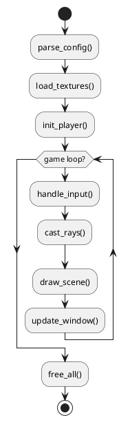

# SPEC-01-CUB3D

## Background

O projeto **Cub3D** é inspirado em jogos como *Wolfenstein 3D*, com o objetivo de criar um motor de renderização 3D simples em **C**, utilizando a biblioteca **MiniLibX** no Linux. O jogo deve interpretar um mapa em 2D e renderizá-lo em primeira pessoa, simulando perspectiva 3D através de *raycasting*. O foco é compreender técnicas de gráficos 2D/3D, gestão de eventos e organização modular de código.

---

## Requirements

### Must Have

* Renderização em 3D via raycasting (baseado no mapa 2D)
* Leitura e validação do arquivo `.cub`
* Controle de câmera e movimento (WASD + setas)
* Colisão com paredes
* Exibição de texturas para cada direção (N, S, E, W)
* Exibição de minimapa 2D opcional
* Gestão de erros robusta e liberação de memória segura
* Conformidade com a *Norminette* e *Makefile* funcional

### Should Have

* Controle de FPS ou *frame capping*
* Texturas animadas (porta, chama, etc.)
* Sistema de log para debugging

### Could Have

* Sons (usando biblioteca externa)
* Sprites decorativos
* HUD com informações do jogador

---

## Method

### 1. Estrutura de pastas

```
cub3d/
├── include/
│   ├── cub3d.h
│   ├── render.h
│   ├── map.h
│   ├── raycast.h
│   ├── utils.h
│   └── events.h
│
├── src/
│   ├── main.c
│   ├── init/
│   │   ├── init_game.c
│   │   ├── load_textures.c
│   │   └── parse_config.c
│   │
│   ├── render/
│   │   ├── raycasting.c
│   │   ├── draw_walls.c
│   │   ├── draw_minimap.c
│   │   └── textures.c
│   │
│   ├── events/
│   │   ├── handle_keys.c
│   │   ├── move_player.c
│   │   └── rotate_player.c
│   │
│   ├── map/
│   │   ├── read_map.c
│   │   ├── validate_map.c
│   │   └── flood_fill.c
│   │
│   └── utils/
│       ├── free_all.c
│       ├── errors.c
│       ├── str_utils.c
│       ├── file_utils.c
│       └── math_utils.c
│
├── assets/
│   ├── textures/
│   └── maps/
│
├── tests/
│   ├── test_maps/
│   ├── valgrind_tests.sh
│   └── run_norme.sh
│
├── Makefile
└── README.md
```

### 2. Estruturas principais (headers)

```c
// cub3d.h
typedef struct s_vec2 {
    double x;
    double y;
}   t_vec2;

typedef struct s_player {
    t_vec2 pos;
    t_vec2 dir;
    t_vec2 plane;
    double move_speed;
    double rot_speed;
}   t_player;

typedef struct s_map {
    char **grid;
    int width;
    int height;
}   t_map;

typedef struct s_game {
    void *mlx;
    void *win;
    t_map map;
    t_player player;
    void *tex[4];
}   t_game;
```

### 3. Fluxo de execução (PlantUML)



### 4. Funções utilitárias principais

```c
void free_game(t_game *game);
void free_map(char **map);
void error_exit(char *msg, t_game *game);
char *read_file(char *path);
```

---

## Implementation

### Etapas de desenvolvimento

1. **Setup inicial**

   * Estruturar pastas, criar `Makefile`, e testar compilador (gcc -Wall -Wextra -Werror).
   * Implementar `main.c` com uma janela aberta via MiniLibX.

2. **Parsing e mapa**

   * Ler o arquivo `.cub` e extrair caminhos de texturas, cores e mapa.
   * Validar mapa com *flood fill* (paredes fechadas, caracteres válidos).

3. **Inicialização do jogo**

   * Criar structs (`t_game`, `t_player`, `t_map`).
   * Carregar texturas (mlx_xpm_file_to_image).

4. **Renderização e Raycasting**

   * Implementar algoritmo de DDA (Digital Differential Analyzer).
   * Calcular distância das paredes e desenhar colunas verticais.

5. **Eventos e movimento**

   * Mapear teclas (mlx_hook, mlx_key_hook).
   * Implementar movimentação suave e rotação.

6. **Gestão de erros e liberação de memória**

   * Centralizar *frees* em `free_all.c`.
   * Adicionar mensagens de erro claras em `errors.c`.

7. **Debugging e testes**

   * Script `valgrind_tests.sh` para leaks.
   * Script `run_norme.sh` para verificar Norminette.

---

## Division of Work (2 pessoas)

| Pessoa A                          | Pessoa B                                    |
| --------------------------------- | ------------------------------------------- |
| Parsing de arquivo `.cub`         | Renderização com Raycasting                 |
| Estrutura e validação de mapa     | Manipulação de eventos e movimentos         |
| Inicialização de structs          | Texturas e desenho de paredes               |
| Funções utils e gestão de memória | Minimap, otimizações e refinamentos visuais |

---

## Priority Order (funções)

1. **Parsing do mapa e configurações**
2. **Inicialização de estruturas**
3. **Raycasting básico (paredes coloridas)**
4. **Renderização com texturas**
5. **Movimento e colisão**
6. **Gestão de erros e limpeza de memória**
7. **Minimap e polimento visual**

---

## Makefile (exemplo)

```makefile
NAME = cub3d
CC = gcc
CFLAGS = -Wall -Wextra -Werror -Iinclude
MLX = -lmlx -lXext -lX11 -lm
SRC_DIR = src
OBJ_DIR = obj

SRC = $(shell find $(SRC_DIR) -name '*.c')
OBJ = $(SRC:$(SRC_DIR)/%.c=$(OBJ_DIR)/%.o)

$(OBJ_DIR)/%.o: $(SRC_DIR)/%.c
	@mkdir -p $(dir $@)
	$(CC) $(CFLAGS) -c $< -o $@

$(NAME): $(OBJ)
	$(CC) $(OBJ) $(MLX) -o $(NAME)

all: $(NAME)

clean:
	rm -rf $(OBJ_DIR)

fclean: clean
	rm -f $(NAME)

re: fclean all

norm:
	norminette src include | grep -v OK || true

run:
	./$(NAME) assets/maps/example.cub

.PHONY: all clean fclean re norm run
```

---

## Testes e Ferramentas Auxiliares

### `tests/valgrind_tests.sh`

```bash
#!/bin/bash
make re > /dev/null
valgrind --leak-check=full --show-leak-kinds=all ./cub3d assets/maps/test1.cub
```

### `tests/run_norme.sh`

```bash
#!/bin/bash
echo "Verificando Norminette..."
norminette src include | grep -v OK || echo "Tudo conforme a norma!"
```

Tornar ambos executáveis:

```bash
chmod +x tests/valgrind_tests.sh tests/run_norme.sh
```

---

## Milestones

| Etapa | Entregável                        | Prazo sugerido |
| ----- | --------------------------------- | -------------- |
| M1    | Janela + parsing inicial          | 3 dias         |
| M2    | Mapa validado + jogador carregado | 5 dias         |
| M3    | Raycasting básico                 | 7 dias         |
| M4    | Texturas e movimento              | 10 dias        |
| M5    | Debug e norminette OK             | 12 dias        |

---

## Gathering Results

* **Critérios de sucesso:**

  * Nenhum *memory leak* (valgrind clean)
  * Norminette sem erros
  * FPS estável >30
  * Mapa 100% fechado e sem *segfaults*

* **Ferramentas de verificação:**

  * `valgrind ./cub3d maps/test1.cub`
  * `./run_norme.sh`
  * `mlx leaks` script personalizado para teste de handles

---

## Need Professional Help in Developing Your Architecture?

Please contact me at [sammuti.com](https://sammuti.com) :)

